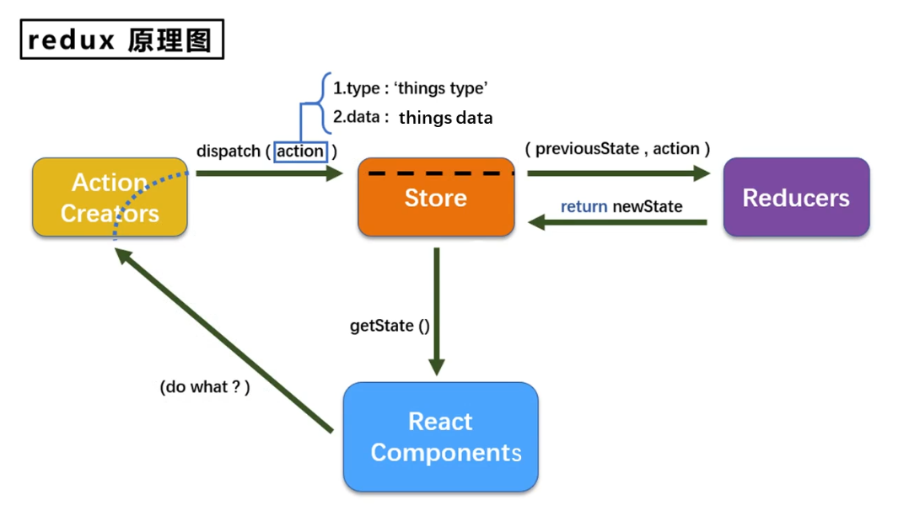
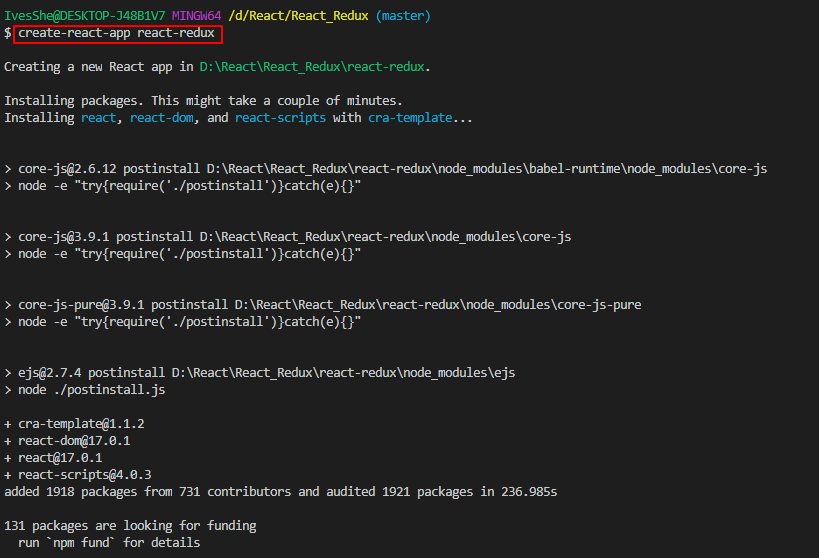
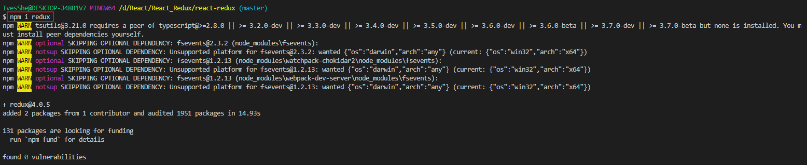
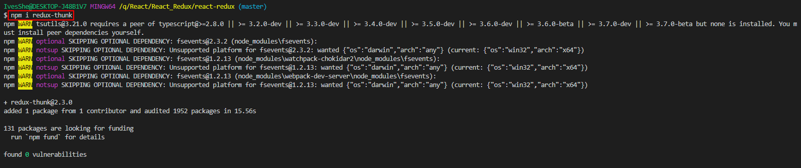
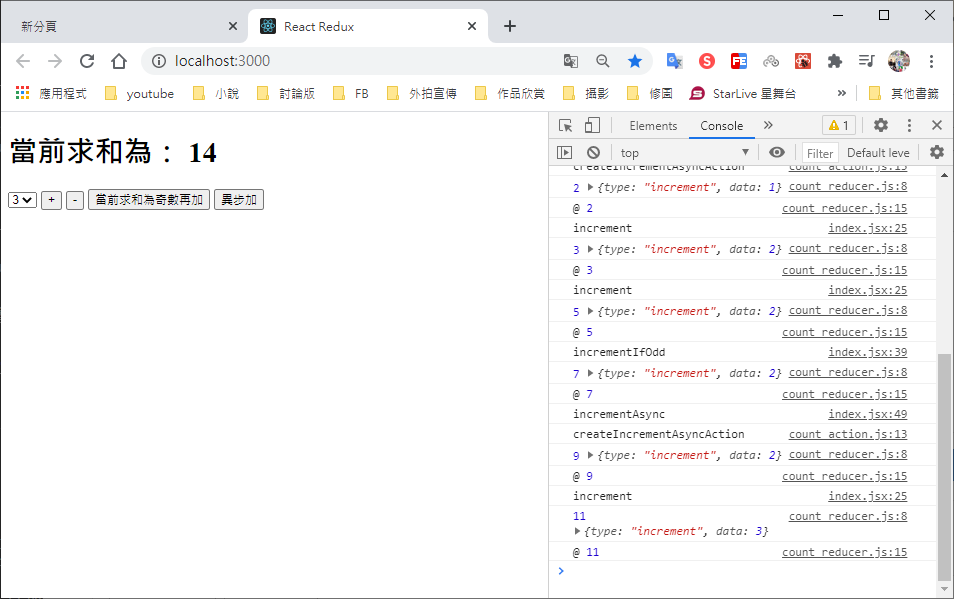

# React Redux

Github展示

https://ivesshe.github.io/React_Redux/


# Redux是什麼

1. redux是一個專門用於作狀態管理的js庫(不是react插件庫)
2. 它可以用於在react,angular,vue等項目中，但基本與react配合使用
3. 作用：集中式管理react應用中多個組件共享的狀態

# 什麼時候需要使用redux

1. 某個組件的狀態，需要讓其它組件可以隨時拿到(共享)
2. 一個組件需要改變另一個組件的狀態(通信)
3. 總體原則：能不用就不用，如果不用比較吃力才考慮使用

# redux工作流程



# redux的三個核心概念

## action

1. 動作的對象
2. 包含2個屬性
    - type： 標識屬性，值為字符串，唯一，必要屬性
    - data： 數據屬性，值類型任意，可選屬性
3. 例子
```jsx
{type:'ADD_STUDENT',data:{name:'tom',age:18}}
```

## reducer

1. 用於初始化狀態，加工狀態
2. 加工時，根據舊的state和action，產生新的state的純函數
## store

1. 將state、action、reducer聯繫在一起的對象
2. 如何得到此對象?
```jsx
1. import {createStore} from 'redux'
2. import reducer from './reducers'
3. const store = createStore(reducer)
```

3. 此對象的功能?
```jsx
1. getState(): 得到state
2. dispatch(action): 分發action，觸發reducer調用，產生新的state
3. subscribe(listener): 註冊監聽，當產生了新的state時，自動調用
```

 創建項目

```bash
create-react-app react-redux
```



# 簡化檔案結構

創建完成之後，刪除不要的檔案

最後只留四個檔案

詳細可參考之前項目

https://github.com/IvesShe/React_Router

# 安裝redux

```bash
npm i redux 
```



# 求和案例_redux精簡版

1. 去除Count組件自身的狀態

2. src下建立：
    - src
        - redux
            - store.js
            - count_reducer.js

3. store.js
    - 引入redux中的createStore函數，創建一個store
    - createStore調用時要傳入一個為其服務的reducer
    - 記得暴露store對象

4. count_reducer.js:
    - reducer的本質是一個函數，接收: preState,action，返回加工後的狀態
    - reducer有兩個作用: 初始化狀態，加工狀態
    - reducer被第一次調用時，是store自動觸發的，傳遞的preState是undefined
        + 傳遞的preState是undefined
        + 傳遞的action是: {type:'@@REDUX/INIT_a.2.b.4'}

5. 在index.js中監測store中狀態的改變，一旦發生重新渲染<App/>    
    備註: redux只負責管理狀態，至於狀態的改變驅動著頁面的展示，要靠自己寫

# 求和案例_redux完整版    

新增文件：

1. count_action.js 專門用於創建action對象
2. constant.js 放置容易寫錯action中的type

# 求和案例_redux_異步action版

1. 明確: 延遲的動作不想交給組件自身，想交給action
2. 何時需要異步action: 想要對狀態進行操作，但是具體的數據靠異步任務返回
3. 具體編碼
    - npm i redux-thunk，並配置在store中
    - 創建action的函數不再返回一般對象，而是一個函數，該函數中寫異步任務
    - 異步任務有結果後，分發一個同步的action去真正操作數據
4. 備註: 異步action不是必須要寫的，完全可以自己等待異步任務的結果果，再去分發同步action    

## 需要安裝異步中間件

```bash
npm i redux-thunk
```




# 執行畫面



# Github上傳
可以參考之前的文檔

https://github.com/IvesShe/React_TodoList